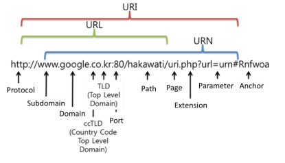

# 0420 TIL

## Class

 1. **내용 요약**

    1. URL

    2. API

    3. REST

    4. JSON

    5. DRF

         

 2. **오늘 새롭게 알게 된 것**

    

    1. URI

         
    
         * URL
           * 통합 자원 위치
           * 네트워크 상에 자원이 어디 있는지 알려주기 위한 약속
           * 과거에는 실제 위치를 나타냈지만 현재는 추상화된 의미론적인 구성
         * URN
           * 통합 자원 이름
           * URL과 달리 자원의 위치에 영향을 받지 않은 유일한 이름 역할, ISBN
         * URI
           * 통합 자원 식별자
           * 인터넷의 자원을 식별하는 유일한 주소
           * 인터넷에서 자원을 식별하거나 이름을 지정하는데 사용되는 간단한 문자열
           * URN은 사용 비율이 적기에 URI == URN이라고도 할 수 있다.
         * URI의 구조
           * Scheme(protocol)
             * 브라우저가 사용해야하는 프로토콜
           * Host
             * 요청을 받는 웹 서버
           * Port
             * 웹 서버 안에 리소스에 접근하는데 사용되는 기술적인 문 번호
             * 포트 번호를 통해서 한 컴퓨터에 존재하는 여러 서버에 접속 가능
           * Path
             * 웹 서버 상의 리소스 경로
             * 초기에는 실제 물리적 위치를 나타냈지면 최근엔 추상화 형태의 구조
           * Query String Parameter
             * 웹 서버에 제공하는 추가적인 데이터
             * &로 구분되는 key-value 목록
           * Fragment
             * Anchor
             * HTML 문서의 특정 부분을 보여주기 위한 방법
             * 부분 식별자라고도 불림
             * 서버에 요청을 보내는 것은 아니다!!!
    
         
    
    1. API
    
         * Application Programming Interface
    
         * 프로그래밍 언어가 제공하는 기능을 수행할 수 있게 만든 인터페이스
    
         * 애플리케이션과 프로그램으로 소통하는 방법
    
         * Web API
    
           * 웹 애플리케이션 개발에서 다른 서비스에 요청을 보내고 응답을 받기 위해 정의 된 명세
           * 현재 웹 개발은 모든 것을 개발 X, 여러 Open API를 활용하는 추세
           * 카카오 페이, SNS로그인, Youtube API 등등 다양함!!!!
    
         * 응답 데이터 타입
    
           * HTML, XML, JSON
    
             
    
    1. REST
    
         * Repersentational State Transfer
    
         * API server를 개발하기 위한 일종의 소프트웨어 설계 방법론
    
         * 네트워크 구조 원리의 모음
    
         * REST의 원리를 따르는 시스템 == RESTful

         * REST의 자원과 주소의 지정

           * 자원 : URI
           * 행위 : HTTP Method
           * 표현 : JSON

         * 핵심 규칙

           * 정보는 URI로 표현
           * 자원에 대한 행위는 HTTP Method(GET, POST, PUT, DELETE)로 표현 (CRUD)
    
         * 반드시 지켜야하는 것은 아니나 지키면 좋다!
    
           

    1. JSON

         * 자바스크립트의 표기법을 따른 단순 문자열

         * 사람이 읽거나 쓰기 쉽고 기계가 파싱하고 만들어내기 쉬움

         * 파이썬의 dict, 자바스크립트의 object처럼 C계열의 언어가 갖고있는 자료구조를 쉽게 변화 할 수 있는 key-value 형태의 구조를 가짐
    
           
    
    1. RESTful API
    
         * REST의 원리를 따라 설계한 API
         * 프로그래밍을 통해 클라이언트의 요청에 JSON을 응답하는 서버를 구성하는 것
         * 이젠 API 제공자의 입장에서 만들어보는 연습
         * DRF!!!!! 는 내일...

 3. **감상**
     1. 채용 공고에서 많이 보였던 RESTful API를 오늘 배웠다.
     1. 중요한 부분이기 때문에 좀 더 자료를 찾아가면서 꼼꼼하게 정리해 두는 편이 좋을 것 같다.
     1. DRF도 익숙해지면 재밌을 것 같은데 좀 더 지켜보자...
     1. 정처기는 운에 맡기도록 하겠다...
     1. 제발...
