day 2

# Git 기초

#### 최초 한 번만 설정합니다. 매번 Git을 사용할 때마다 설정할 필요가 없습니다.

1. 누가 기록을 남겼는지 이메일과 이름 설정

   작성자를 수정하고 싶을 때는 이름, 주소만 변겅

   $ git config --global user.name "이름"

   $ git config --global user.email"메일 주소"

   $ git config --global -l 확인

   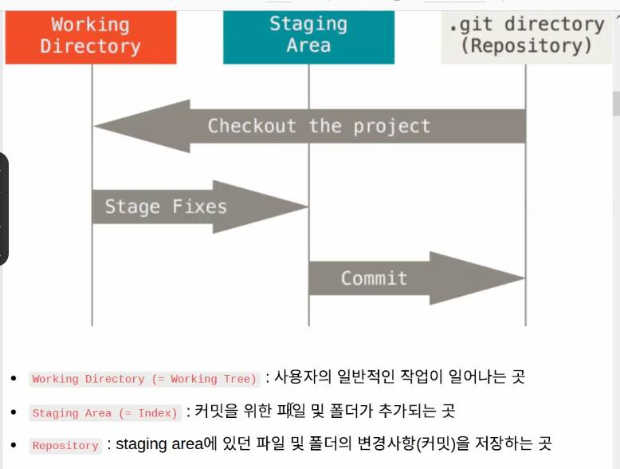

​	

(1) git init

​	$ git init

​	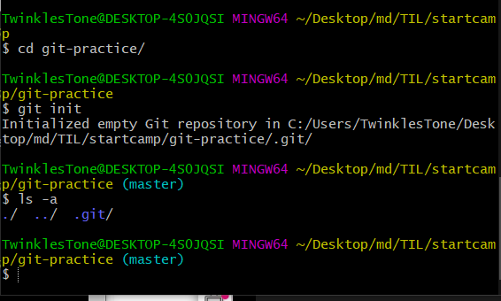

​	.git 이라는 숨김 폴더 생성 후 (master)라는 표기로 git에서 관리한다는 뜻

​	!!!!! 이미 Git 저장소 폴더 내에 Git 저장소를 만들지 않음 (중첩 금지) > 깃에서 디렉토리 인식 어려움

​			절대로 홈 디렉토리에서 git init을 하지 않는다. 터미널 경로가 ~인지 확인 !!!!!!

​			(이미 Git에서 관리하는 중에 클론을 가져와도 같은 상황이 발생)

​			(홈에서 git init을 하면 내 컴퓨터 모든 파일을 깃에서 관리함으로 무겁고 쓸데없음)

(2) git status

(day2.assets/image-20220113101024809.png)

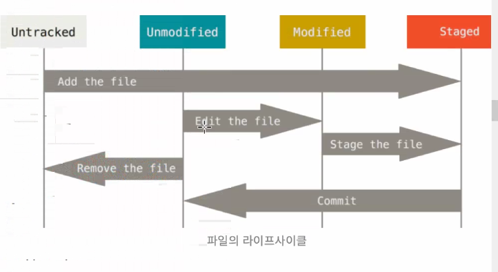

(3) git add

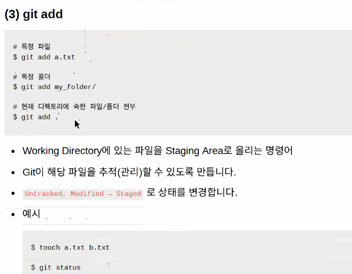

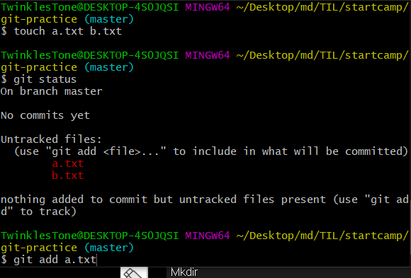

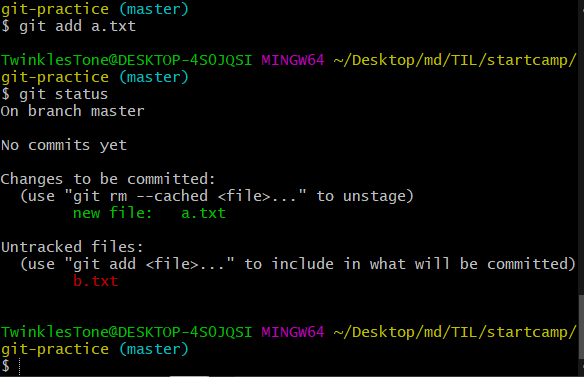

​				staigng area에 올라간 상태

(4) git commit

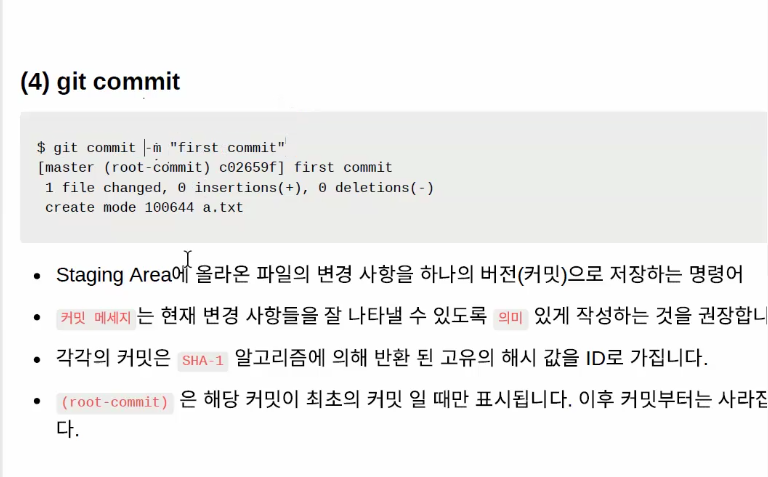

(5) git log

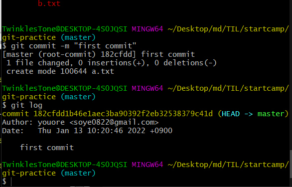

​				first commit 문구는 변경 가능!

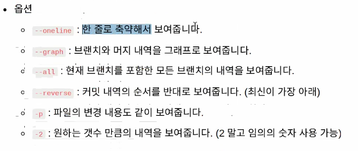

옵션은 생략가능 인자는 생략 불가 (ex. git add ? git add a.txt > a.txt 가 인자)

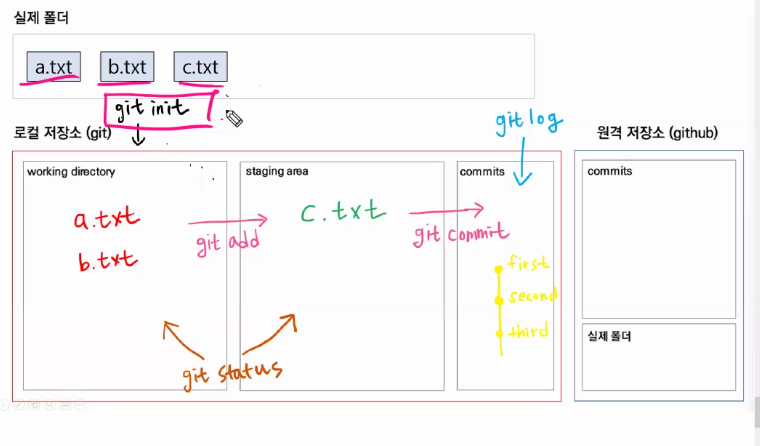

정리 add 찍으면 staging area로 감, git commit  -m " " 찍으면 커밋으로 감 (log 찍으면 나옴)

원격 저장소와는 아직 관련 없음

[1] 원격 저장소 올리기

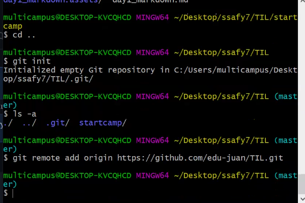ㅎㅎ

git push -u origin master 해서 올리면 끝~

git 명령어

git remote add origin 주소 > 원격 저장소 추가

git push -u origin master 보내기

git pull 받기

rm -rf .git 히스토리 삭제

git pull --rebase 원격저장소 별칭 master > 동기화 시키기 [rejecter 오류]

(무조건 push한다고해서 업로드가 아닌 기존 내용을 pull 하고 push 해야함)

(주의)

파일 드래그 업로드 XXX > 원격저장소와 로컬 저장소 동기화 문제

(README 수정)

생성 > status > 트래킹 x 파일

로컬 수정 > status > 모디파이드 파일

깃 에드 > 수정된 리드미 > 깃커밋 > 깃 푸쉬!

삭제 된 파일도 git add로 올려야 인식 가능

이름 변경 > 전 파일 삭제 새로운 파일 생성 되었다고 트래킹함

.gitignore

반드시 . 찍어서 만들고 .git 폴더와 동일한 위치

gitignore.io > gitignore 편하게 해주는 곳

각각 환경설정후 전체 복사 > code . 으로 vs code 실행

.gitignore 에 붙여넣기 후

*.txt  추가 > 모든 텍스트 트래킹 X

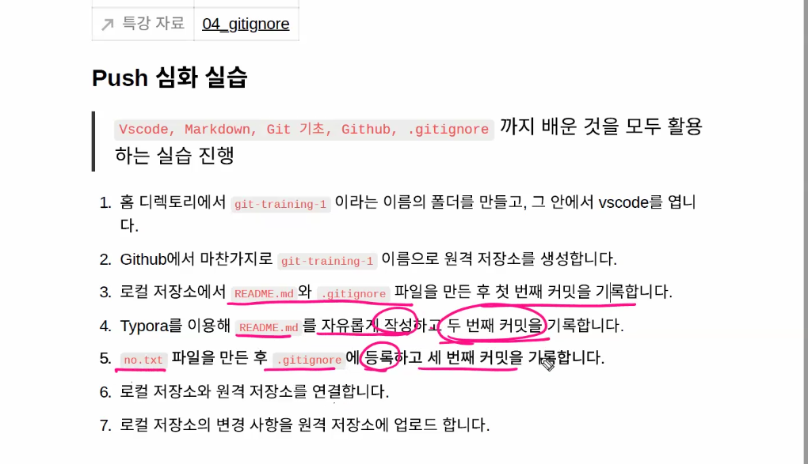

clone 과 pull

git clone <원격저장소 주소> 원격 저장소를 통째로 복제해서 내 컴퓨터에 올길 수 있음.

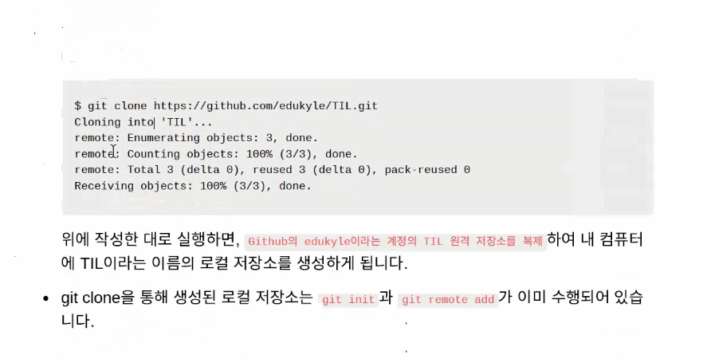

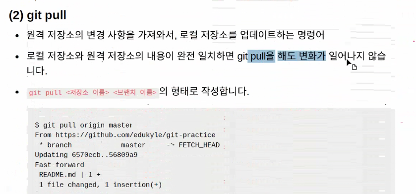

 git pull origin master

git pull 후 git push 하는 것이 순서!

git pull 로 최신버전을 가져온다음에 해야 오류 안뜸!

처음은 clone 으로 내려받고 그 이후는 pull로!

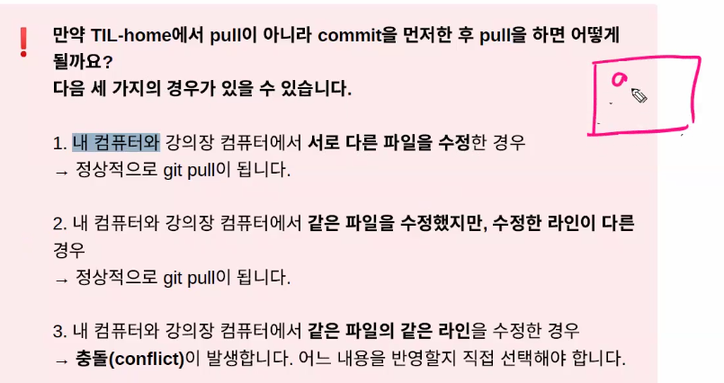

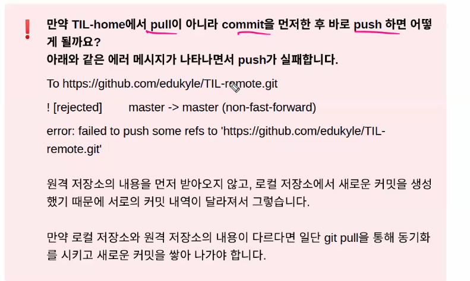

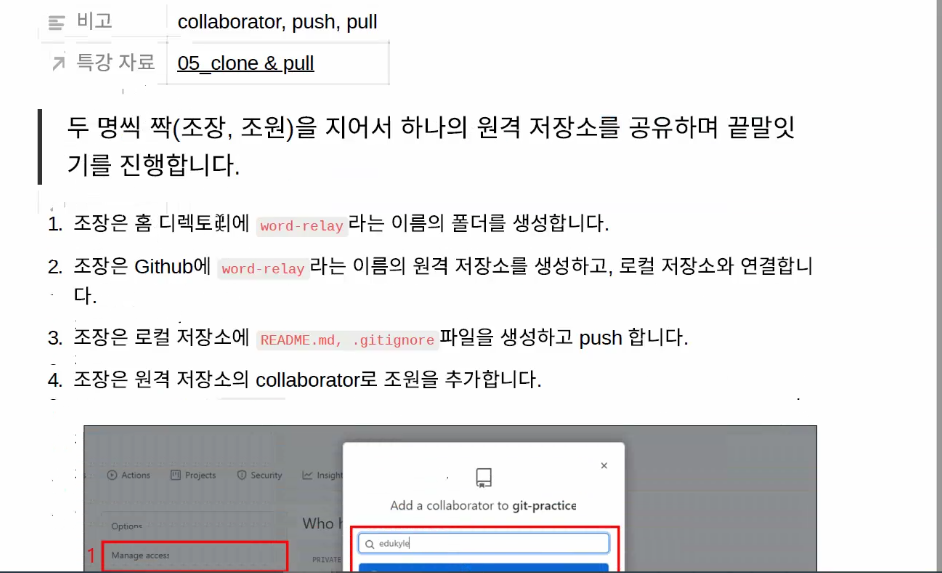

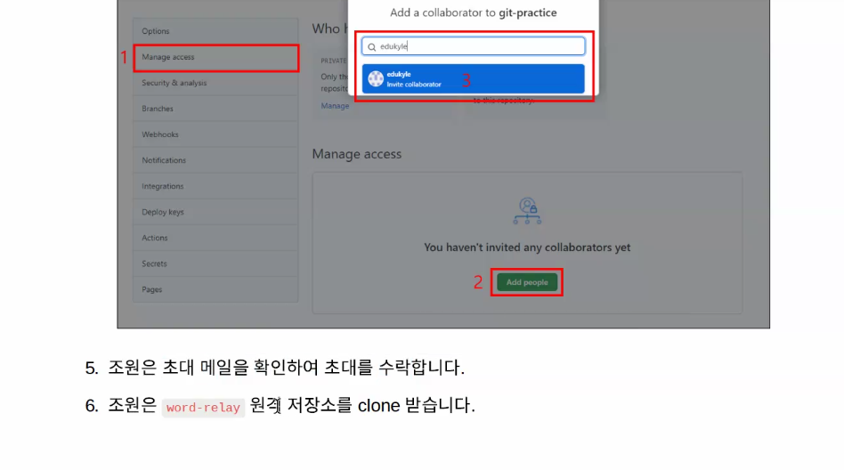

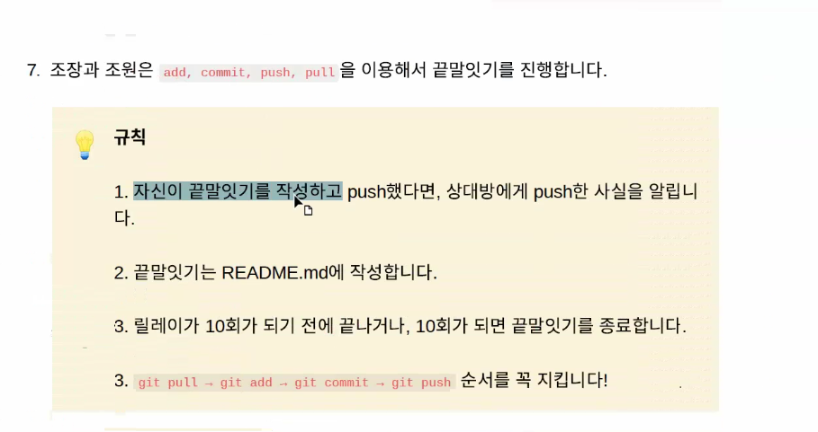

read me 에 정리

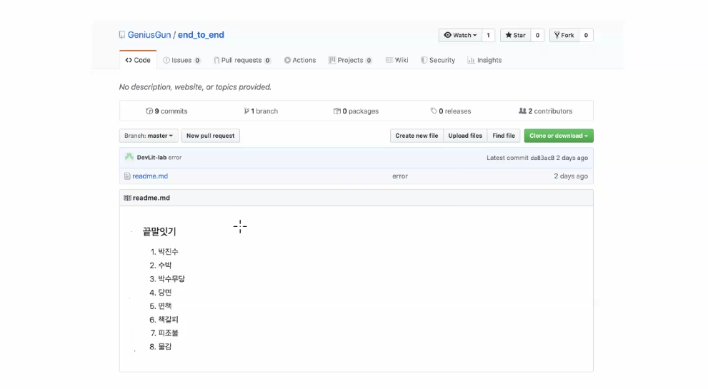

Branch 버전 관리의 꽃?

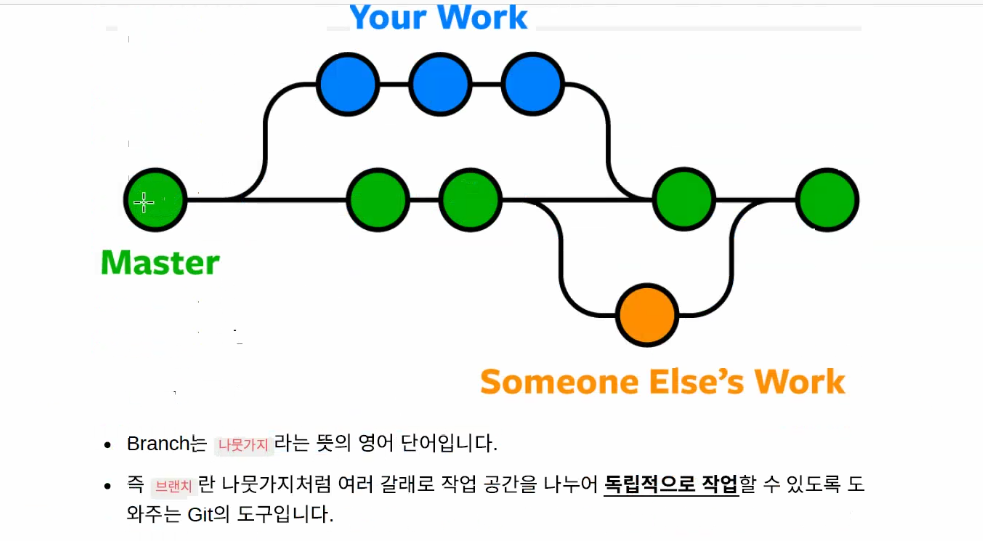

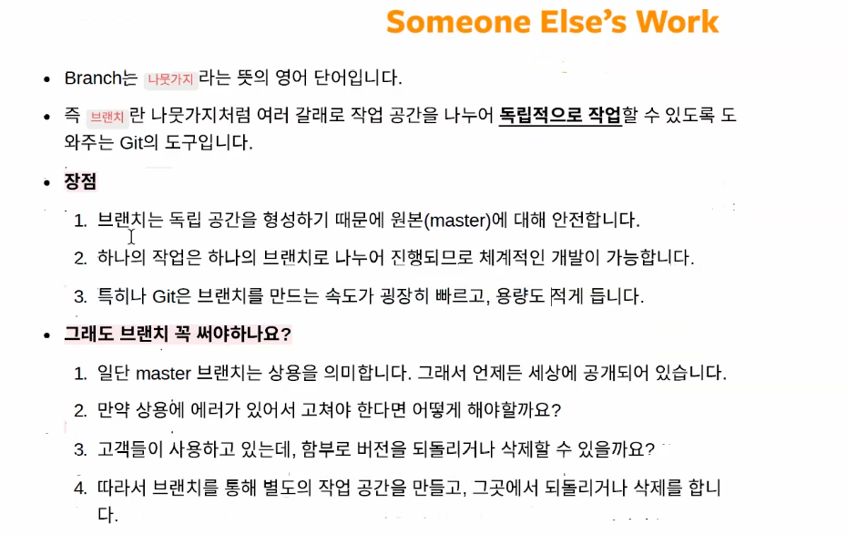

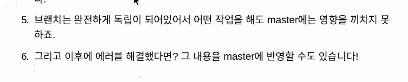

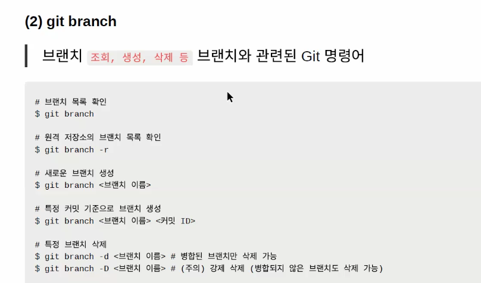

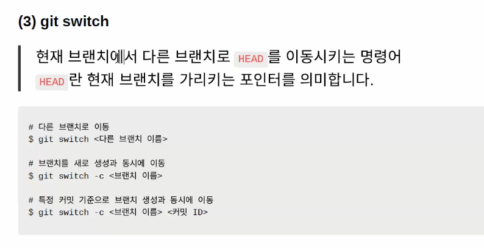

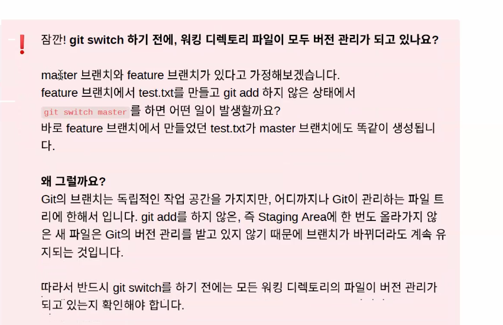